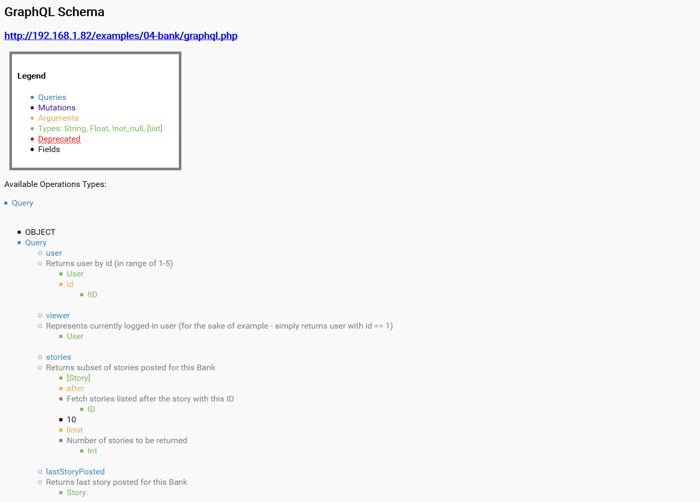

### GraphQL Introspection
#### A small tool to query a GraphQL endpoint with introspection in order to retrieve the documentation of all the queries & mutations
Author:	Paolo Stagno (@Void_Sec)

Version:	1.0

Usage: GraphQL_Introspection.py -t 192.168.1.82/examples/04-bank/graphql -o report.html

