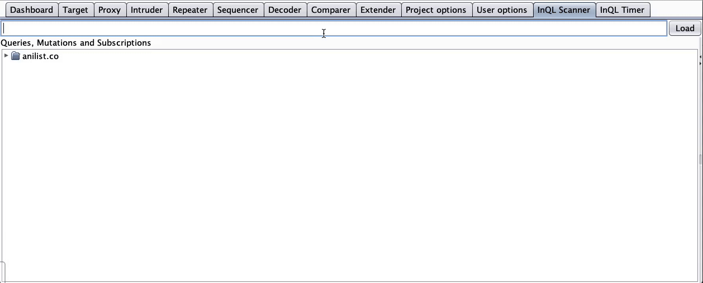

# InQL Scanner

A security testing tool to facilitate [GraphQL](https://graphql.org/) technology security auditing efforts.


InQL can be used as a stand-alone script or as a [Burp Suite](https://portswigger.net/burp) extension.

## InQL Stand-Alone CLI

Running `inql` from Python will issue an [Introspection](https://graphql.org/learn/introspection/) query to the target GraphQL endpoint in order fetch metadata information for:

- Queries, mutations, subscriptions
- Its fields and arguments
- Objects and custom object types
- Cycles inside the graphql definition

InQL can inspect the introspection query results and generate clean documentation in different formats such as
HTML and JSON schema. InQL is also able to generate templates (with optional placeholders) for all known basic data types.

For all supported options, check the command line help:

```
usage: inql [-h] [--nogui] [-t TARGET] [-f SCHEMA_JSON_FILE] [-k KEY]
            [-p PROXY] [--header HEADERS HEADERS] [-d] [--no-generate-html]
            [--no-generate-schema] [--no-generate-queries] [--generate-cycles]
            [--cycles-timeout CYCLES_TIMEOUT] [--cycles-streaming]
            [--insecure] [-o OUTPUT_DIRECTORY]

InQL Scanner

optional arguments:
  -h, --help            show this help message and exit
  --nogui               Start InQL Without Standalone GUI [Jython-only]
  -t TARGET             Remote GraphQL Endpoint (https://<Target_IP>/graphql)
  -f SCHEMA_JSON_FILE   Schema file in JSON format
  -k KEY                API Authentication Key
  -p PROXY              IP of a web proxy to go through (http://127.0.0.1:8080)
  --header HEADERS HEADERS
  -d                    Replace known GraphQL arguments types with placeholder
                        values (useful for Burp Suite)
  --no-generate-html    Generate HTML Documentation
  --no-generate-schema  Generate JSON Schema Documentation
  --no-generate-queries
                        Generate Queries
  --generate-cycles     Generate Cycles Report
  --cycles-timeout CYCLES_TIMEOUT
                        Cycles Report Timeout (in seconds)
  --cycles-streaming    Some graph are too complex to generate cycles in
                        reasonable time, stream to stdout
  --insecure            Accept any SSL/TLS certificate
  -o OUTPUT_DIRECTORY   Output Directory
```

## InQL Burp Suite Extension

Since version 1.0.0 of the tool, InQL was extended to operate within Burp Suite. In this mode, the tool will retain all the stand-alone script capabilities and add a handy user interface for manipulating queries. 

Using the `inql` extension for Burp Suite, you can:

+ Search for known GraphQL URL paths; the tool will grep and match known values to detect GraphQL endpoints within the target website
+ Search for exposed GraphQL development consoles (*GraphiQL*, *GraphQL Playground*, and other standard consoles)
+ Use a custom GraphQL tab displayed on each HTTP request/response containing GraphQL
+ Leverage the templates generation by sending those requests to Burp's Repeater tool ("Send to Repeater")
+ Leverage the templates generation and editor support by sending those requests to embedded GraphIQL ("Send to GraphiQL")
+ Configure the tool by using a custom settings tab


To use `inql` in Burp Suite, import the Python extension:

+ Download the [Jython](https://www.jython.org/download) Jar
+ Start Burp Suite
+ Extender Tab > Options > Python Enviroment > Set the location of Jython standalone JAR
+ Extender Tab > Extension > Add > Extension Type > Select Python
+ Download the latest `inql_burp.py` release [here](https://github.com/doyensec/inql/releases)
+ Extension File > Set the location of `inql_burp.py` > Next
+ The output should now show the following message: `InQL Scanner Started!`

### Burp Extension Usage

Getting started with the `inql` Burp extension is easy:

1. Load a GraphQL endpoint or a JSON schema file location inside the top input field
2. Press the "Load" button
3. After a few seconds, the left panel will refresh, loading the directory structure for the selected endpoint as in the following example:
+ url
+ - query
+  - - timestamp 1
+  - - - query1.query
+  - - - query2.query
+  - - timestamp 2
+  - - - query1.query
+  - - - query2.query
+ - mutation
+ - subscription
4.  Selecting any *query*/*mutation*/*subscription* will load the corresponding template in the main text area


### Burp GraphQL Query Timer

Since version 3.0.0, InQL now has an integrated Query Timer.
This Query Timer is a reimagination of [Request Timer](https://github.com/PortSwigger/request-timer), which can filter for query name and body.

The Query Timer is enabled by default and especially useful in conjunction with the Cycles detector. A tester can switch between graphql-editor modes (Repeater and GraphIQL) to identify [DoS queries](https://www.diva-portal.org/smash/get/diva2:1302887/FULLTEXT01.pdf). Query Timer demonstrates the ability to attack such vulnerable graphql endpoints by counting the execution time of each and every query.



## InQL Stand-Alone UI

Since version 2.0.0, InQL UI is now able to operate without requiring BURP.
It is now possible to install InQL stand-alone for `jython` and run the Scanner UI.

In this mode, InQL maintains most of the Burp Scanner capabilities except for advanced 
interactions such as "Send To Repeater" and automatic authorization header generation, available through BURP.

To use `inql` stand-alone UI:

+ Download and Install [Jython](https://www.jython.org/download). Jython can be obtained on macOS through brew `brew install jython` or on Ubuntu derivates through `apt-get install -y jython`
+ Install inql through pip with `jython -m pip install inql`
+ Start the UI through jython with `jython -m inql`

## InQL Documentation Generator

In either BURP or Stand-Alone mode, InQL can generate meaningful documentation for available GraphQL entities.
Results are available as HTML pages or query templates.

The resulting HTML documentation page will contain details for all available `Queries`, `Mutations`, and `Subscriptions` as shown here:


The following screenshot shows the use of templates generation:


### InQL Precise Queries

Based on the 3.0.0 introduced introspection intermediate representation (IIR), InQL is able to generate arbitrarily nested queries with support to
any scalar type, enumerations, arrays, and objects.

```javascript
query {
  Character(id_not_in:[1334], sort:[ROLE_DESC], search:"code", id_not:1334, id:1334, id_in:[1334]) {
    image {
      large
    }
    siteUrl
    favourites
    modNotes
    description(asHtml:true)
    media(sort:[TITLE_ROMAJI], type:ANIME, perPage:1334, page:1334) {
      edges {
        isMainStudio
      }
    }
    name {
      last
    }
    id
    isFavourite
    updatedAt
  }
}
```

While this enables seamless "Send to Repeater" functionality from the Scanner to the other tool parts (Repeater and GraphiQL console), it is still impossible for the tool to infer placeholders for [GraphQL Custom Scalars](https://hasura.io/docs/1.0/graphql/core/actions/types/index.html#custom-scalars).


### InQL Cycles Detector

The new introspection intermediate representation (IIR) allows to inspect for cycles in defined graphql schemas by requiring access to graphql introspection-enabled endpoint only.

This functionality is especially useful and automates bothersome testing practices employing graph solving algorithm. In our test, the tool was able to find millions of cycles a minute.

## Credits

*Author and Maintainer:* Andrea Brancaleoni ([@nJoyneer](https://twitter.com/nJoyneer) - [thypon](https://github.com/thypon))

This project was made with love in [Doyensec Research island](https://doyensec.com/research.html).
