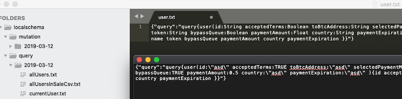

# InQL Scanner

A security testing tool to facilitate [GraphQL](https://graphql.org/) technology security auditing efforts.


InQL can be used as a stand-alone script, or as a [Burp Suite](https://portswigger.net/burp) extension.

## InQL Stand-Alone CLI

Running `inql` from Python will issue an [Introspection](https://graphql.org/learn/introspection/) query to the target GraphQL endpoint in order fetch metadata information for:

- Queries, mutations, subscriptions
- Its fields and arguments
- Objects and custom objects types

InQL can inspect the introspection query results and generate clean documentation in different formats, such as
HTML and JSON schema. InQL is also able to generate templates (with optional placeholders) for all known basic data types.

For all supported options, check the command line help:

```
usage: inql [-h] [--nogui] [-t TARGET] [-f SCHEMA_JSON_FILE] [-k KEY]
            [-p PROXY] [--header HEADERS HEADERS] [-d] [--generate-html]
            [--generate-schema] [--generate-queries] [--insecure]
            [-o OUTPUT_DIRECTORY]

InQL Scanner

optional arguments:
  -h, --help            show this help message and exit
  --nogui               Start InQL Without Standalone GUI [Jython-only]
  -t TARGET             Remote GraphQL Endpoint (https://<Target_IP>/graphql)
  -f SCHEMA_JSON_FILE   Schema file in JSON format
  -k KEY                API Authentication Key
  -p PROXY              IP of web proxy to go through (http://127.0.0.1:8080)
  --header HEADERS HEADERS
  -d                    Replace known GraphQL arguments types with placeholder
                        values (useful for Burp Suite)
  --generate-html       Generate HTML Documentation
  --generate-schema     Generate JSON Schema Documentation
  --generate-queries    Generate Queries
  --insecure            Accept any SSL/TLS certificate
  -o OUTPUT_DIRECTORY   Output Directory
```

## InQL Burp Suite Extension

Since version 1.0.0 of the tool, InQL was extended to operate within Burp Suite. In this mode, the tool will retain all the capabilities of the stand-alone script plus a handy user interface to manipulate queries. 

Using the `inql` extension for Burp Suite, you can:

+ Search for known GraphQL URL paths; the tool will grep and match known values to detect GraphQL endpoints within the target website
+ Search for exposed GraphQL development consoles (*GraphiQL*, *GraphQL Playground*, and other common consoles)
+ Use a custom GraphQL tab displayed on each HTTP request/response containing GraphQL
+ Leverage the templates generation by sending those requests to Burp's Repeater tool ("Send to Repeater")
+ Leverage the templates generation and editor support by sending those requests to embedded GraphIQL ("Send to GraphiQL")
+ Configure the tool by using a custom settings tab


To use `inql` in Burp Suite, import the Python extension:

+ Download the [Jython](https://www.jython.org/download) Jar
+ Start Burp Suite
+ Extender Tab > Options > Python Enviroment > Set the location of Jython standalone JAR
+ Extender Tab > Extension > Add > Extension Type > Select Python
+ Download the latest `inql_burp.py` release [here](https://github.com/doyensec/inql/releases)
+ Extension File > Set the location of `inql_burp.py` > Next
+ The output should now show the following message: `InQL Scanner Started!`

*In future, we might consider integrating the extension within the Burp's BApp Store.*

### Burp Extension Usage

Getting started with `inql` Burp extension is easy:

1. Load a GraphQL endpoint or a JSON schema file location inside the top input field
2. Press the "Load" button
3. After few seconds, the left panel will refresh loading the directory structure for the selected endpoint as in the following example:
+ url
+ - query
+  - - timestamp 1
+  - - - query1.query
+  - - - query2.query
+  - - timestamp 2
+  - - - query1.query
+  - - - query2.query
+ - mutation
+ - subscription
4.  Selecting any *query*/*mutation*/*subscription* will load the corresponding template in the main text area

## InQL Stand-Alone UI

Since version 2.0.0, InQL UI is now able to operate without requiring BURP.
It is now possible to install InQL stand-alone for `jython` and run the Scanner UI.

In this mode InQL maintain most of his Burp Scanner capabilities with the exception of advanced 
interaction such as "Send To Repeater" and automatic authorization header generation, available through BURP.

To use `inql` stand-alone UI:

+ Download and Install [Jython](https://www.jython.org/download). This can be obtained on macOS through brew `brew install jython` or on Ubuntu derivates through `apt-get install -y jython`
+ Install inql through pip with `jython -m pip install inql`
+ Start the UI through jython with `jython -m inql`

## InQL Documentation Generator

Either in BURP or in Stand-Alone mode, InQL is able to generate meaningful documentation for available GraphQL entities.
Results are available as HTML pages or query templates.

The resulting HTML documentation page will contain details for all available `Queries`, `Mutations`, and `Subscriptions` as shown here:


The following screenshot shows the use of templates generation:




## Credits

*Author and Maintainer:* Andrea Brancaleoni ([@nJoyneer](https://twitter.com/nJoyneer) - [thypon](https://github.com/thypon))

*Original Author:* Paolo Stagno ([@Void_Sec](https://twitter.com/Void_Sec) - [voidsec.com](https://voidsec.com))

This project was made with love in [Doyensec Research island](https://doyensec.com/research.html).
