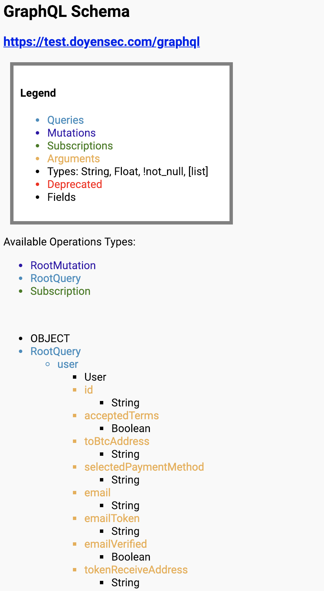

### GraphQL Security Toolkit
With the increasing popularity of [GraphQL](https://graphql.org/) technology, we will be using this repository to publish scripts and other resources that can facilitate security testing efforts.

#### GraphQL Introspection 

A tool to query a GraphQL endpoint with introspection in order to retrieve queries & mutations

*Author:* Paolo Stagno ([@Void_Sec](https://twitter.com/Void_Sec))

Usage: `$python GraphQL_Introspection.py -t http://192.168.1.82/examples/04-bank/graphql -o report-graphql-endpoint`

The resulting HTML page will contain details for available queries and mutations, as shown here:

