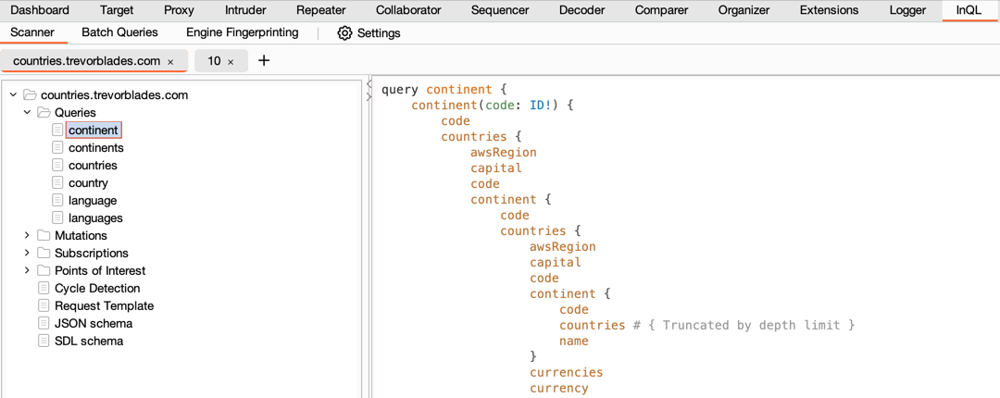

# InQL v6.1.0 - Burp Extension for Advanced GraphQL Testing

[![Doyensec Research Island](https://img.shields.io/static/v1?logo=data:image/png;base64,iVBORw0KGgoAAAANSUhEUgAAACAAAAAgCAMAAABEpIrGAAAABGdBTUEAALGPC/xhBQAAACBjSFJNAAB6JgAAgIQAAPoAAACA6AAAdTAAAOpgAAA6mAAAF3CculE8AAACLlBMVEUsJx8sJx8sJx8tJx8xKiAvKR8rJx8uKB+CWCu7eDK5dzKxcjFTPSQqJh9nSCfskzn4mjv3mjr5mzurbzAwKSCiaS/3mTr0mDr1mTr1mDrqkjlrSicpJR9RPCTaijf2mTrjjjigaS+YZC6ZZS6ZZC6aZS7Vhja/ejM5LiErJh+JWyxxTignJB4oJR55UinxljrylzqCVyspJh9BMyLHfzTFfjQ+MSE4LiG5djLRhDVINyPvlTmKXCxOOiN2USl1UCh0TyhENSJkRyfpkjibZi40LCDXiDZOOiRgRCbljzf0lzn1mDmgaC4tKB+iai/hjTdcQiZdQybljzikay+dZi73mDnkjjdhRSZSPCTbijeyczEyKyDmkDjXhzX2mDn3mTm2dTGJXCztlDlzTylMOSM2LCCEWCr1lznvlDh3USk9MSF/Virwljl8VCrBezLJfzNCMyJwTiiLXSxQOyTijjivcTEoJR/0mDnwlTluTChDNCLWhza8eTMzKyCLXCzslDlENCLKgDTDfDM8MCF7VCrxlzoyKiCOXyzrkzlvTShHNiPPgzVbQiVUPiTeizeucDCTYS1qSidlRyelay/fjDdYQCWobTA2LSCVYi2qbjDcijc1LCBYPyVbQSVJNyM6LyG8eDJFNSJrSyiQYC3zlzrBezPLgTTShTW6dzKEWSt6UymWYy3AezORYC2XYy3aiTa4djJaQSViRiawcjH6nDv4mjqeZy6faC5LOSP////0Gs0gAAAAAnRSTlPw8aiV7g8AAAABYktHRLk6uBZgAAAAB3RJTUUH5wQDChERFF4OgAAAAhhJREFUOMuNk/dXE0EQx8lJNkgcwiLe7eLqAIq6ogYPBaWogFjAEAWxixqsxK5gLygigigasUWw99798wwE3puY98DPr/O5u5nvzSQkGCPiGKVuGP8jjEmMw8mo4Eoam/wP7nFABEjxpPJY0san0x6cE0zLskhdyIyJiggwaTKKzKzsKVGm5kxDPn2GJlPATCk9ubNgiNlzvDJvrk0EnT8P+fyCyDNaKaVZ4QITFxYByUHlFkurBAxdumjxkjKtyisELqVBsUo3x2XLAVasrKpe5WPOGi78q4EkqdbUCl7nYq619dXr1gNs2Ih802ZGovbloNhSbkPp1oZt2ysZ7JAy0KiIADsjsyXvYrC7as/efSradpMmPwuCeXL/AdAFBxvqDx3W6khAWkcZFY4dF6nNLqOlBE+cPKXg9BnkZ88RQZ+35IVGgIutyC9d1qrNK68kkU8M9u1uZ/qqkB3XFHR2ReIuJIKzxhT+6wDdNwS/mciMHpQVt2ySw+0MgdkGSw+Z4k4v2L1+we86SZL3mgOe1k5QKR0S7zPW/sDEh90kSRZ+1NfXz/TjJyZ2PQX1LCDlcx2ztLZSYKjgC+kN2rrpJeKr/FhhcJL+14hvwqrlrSWL39F9GOY9WvLDx55PnwX/EmZxgvqaKSxLDOykqP1mxx0OC3//8XOItCxf/GVB0a9QXZTQ7z8QLwy8ZBgdc1mj3KZj5LrjL1F7eEeDTryKAAAAJXRFWHRkYXRlOmNyZWF0ZQAyMDIzLTA0LTAzVDEwOjE3OjEyKzAwOjAwECxG2gAAACV0RVh0ZGF0ZTptb2RpZnkAMjAyMy0wNC0wM1QxMDoxNzoxMiswMDowMGFx/mYAAAAgdEVYdHNvZnR3YXJlAGh0dHBzOi8vaW1hZ2VtYWdpY2sub3JnvM8dnQAAABh0RVh0VGh1bWI6OkRvY3VtZW50OjpQYWdlcwAxp/+7LwAAABh0RVh0VGh1bWI6OkltYWdlOjpIZWlnaHQAMTkyQF1xVQAAABd0RVh0VGh1bWI6OkltYWdlOjpXaWR0aAAxOTLTrCEIAAAAGXRFWHRUaHVtYjo6TWltZXR5cGUAaW1hZ2UvcG5nP7JWTgAAABd0RVh0VGh1bWI6Ok1UaW1lADE2ODA1MTcwMzLks9aDAAAAD3RFWHRUaHVtYjo6U2l6ZQAwQkKUoj7sAAAAVnRFWHRUaHVtYjo6VVJJAGZpbGU6Ly8vbW50bG9nL2Zhdmljb25zLzIwMjMtMDQtMDMvMWVjNTYyMTlhZWY0YzQ4MDI1N2Y2YWFjYzUxM2M0Y2MuaWNvLnBuZ98kODgAAAAASUVORK5CYII=&link=https://doyensec.com/research.html&message=Research%20Island&&label=Doyensec&color=purple)](https://doyensec.com/research.html)


[](https://github.com/doyensec/inql/tree/dev)
[](AUTHORS)
[](https://github.com/doyensec/inql/issues?q=is%3Aissue+is%3Aopen+label%3A%22Help+Wanted%22)
[](https://github.com/doyensec/inql/issues?q=is%3Aissue+is%3Aopen+label%3A%22Good+First+Issue%22)


## :rocket: Introduction

Welcome to InQL, an open-source GraphQL testing tool. This tool provides features designed to enhance your GraphQL testing experience, making it more efficient and effective. 

We appreciate your trust in InQL. Happy testing!

## :star2: Key Features

The InQL user interface is equipped with three primary components: the *Scanner*, the *Batch Queries*, and the *Engine Fingerprinting* tab

### :mag_right: Scanner



The *Scanner* is the core of InQL, where you can analyze a GraphQL endpoint or a local introspection schema file. It auto-generates all possible queries, mutations, and subscriptions, organizing them into a structured view for your analysis.

**:white_check_mark: Customizable Scans**

InQL offers the flexibility to customize your scans. Adjust the depth of generated queries or the number of spaces used for indentation. You can also perform 'Points of Interest' scans to detect potential vulnerabilities in the GraphQL schema.

**:white_check_mark: Points of Interest Analysis**

After running a Points of Interest scan, you are presented with a rich data set covering a variety of potential vulnerabilities. You can enable or disable these categories according to your needs.

**:white_check_mark: Circular References Detection**

InQL implements circular reference detection. After analyzing the schema, it displays potentially vulnerable queries in the scanner results view.

**:white_check_mark: Enhanced Interactions with Burp**

InQL seamlessly integrates with Burp, enabling you to generate queries directly from any GraphQL request in Burp. You can also send auto-generated queries to other Burp tools for further analysis.

**:white_check_mark: Custom Headers**

You have the ability to set custom headers per domain, with the domain list auto-populated from observed traffic.

### :crossed_swords: Batch Queries

The *Batch Queries* tab lets you run batch GraphQL attacks, which can be useful for circumventing poorly implemented rate limits.

### :memo: Burp's Native Message Editors

Burp's native message editors now come with an additional 'GraphQL (InQL)' tab, providing an efficient way to view and modify GraphQL requests. It also supports schema highlighting for better readability. 

### :crossed_swords: GraphiQL and GraphQL Voyager

InQL now implements GraphiQL and GraphQL Voyager servers. You can send the analysed schame into them to enhance the analysis even further!

### :point_up: Engine Fingerprinting
This tab allows you to scan a GraphQL URL to retrieve information about the backend server technology.

### :construction: Schema Bruteforcer
This scanner is designed to recreate the schema when introspection is disabled. It is based on [Clairvoyance CLI tool](https://github.com/nikitastupin/clairvoyance), using regex pattern matching to discover schema details.

# :arrow_down: Installation

To successfully install InQL, ensure you meet the following requirements:

Burp:

- Support is only provided for the most recent version of Burp.
- Compatible with both "Professional" and "Community" editions.

Java:

- The Montoya API needs Java 17 or later.

## :computer: Building the InQL extension from git

1. Install Java 17+, for example in Debian-based distros:

```bash
$ sudo apt install -y openjdk-17-jdk
$ java --version
openjdk 17.0.6 2023-01-17
```

2. Install our build tool - [Taskfile](https://taskfile.dev):

```bash
$ # Mac OS & Homebrew:
$ brew install go-task
$ # Debian
$ sudo apt install -y task
```

2. Clone the repo and pull submodules:

```bash
$ git clone https://github.com/doyensec/inql
$ cd inql
$ # Optionally, checkout dev branch (might be broken / unstable!)
$ git checkout dev
```

3. Build the InQL extension:

```bash
$ task all
```

This should produce a file named `InQL.jar` or similar in the root of the repo. Load it into Burp
as a Java extension.

**Development environment**

If you want to contribute to the project, no special environment is needed. You can simply re-build the project every time you implement a change.

To speed up the work on the code, you might want to auto-rebuild the extension whenever you make a change. Just run
`kotlin` task with the `--watch` / `-w` flag and you're good to go:

```bash
$ task kotlin -w
```

# :handshake: Contributing

InQL thrives on community contributions. Whether you're a developer, researcher, designer, or bug hunter, your expertise is invaluable to us. We welcome bug reports, feedback, and pull requests. Your participation helps us continue to improve InQL, making it a stronger tool for the community.

Interactions are best carried out through the Github issue tracker, but you can also reach us on social media ([@Doyensec](https://twitter.com/Doyensec)). We look forward to hearing from you!

# :busts_in_silhouette: Contributors

A special thanks to our contributors. Your dedication and commitment have been instrumental in making InQL what it is today.

Current:
- **Maintainer:** Bartłomiej Górkiewicz [@bartek-doyensec (Github)](https://github.com/bartek-doyensec)
- **Contributor:** Savio Sisco [@lokiuox (Github)](https://github.com/lokiuox)

Historical:
- **Author:** Andrea Brancaleoni [@nJoyneer (Twitter)](https://twitter.com/nJoyneer) / [thypon (Github)](https://github.com/thypon)
- **Maintainer:** Andrew Konstantinov [@execveat (Twitter)](https://twitter.com/execveat) / [@execveat (Mastodon)](https://infosec.exchange/@execveat)
- **Contributor:** Matteo Oldani [@matteoldani (Github)](https://github.com/matteoldani)
- List of other contributors: [AUTHORS](AUTHORS)

This project was made with support of [Doyensec](https://doyensec.com/research.html).


