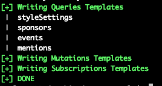

# GraphQL Scanner
A Burp Extension/stand-alone tool to facilitate [GraphQL](https://graphql.org/) technology security testing efforts.

*Author:* Paolo Stagno ([@Void_Sec](https://twitter.com/Void_Sec) - [voidsec.com](https://voidsec.com)) 


### GraphQL Introspection (stand-alone script)

Running `inql` from python will issue an [Introspection](https://graphql.org/learn/introspection/) query to a GraphQL endpoint in order to dump all the: Queries, Mutations, Subscriptions; retrieve their fields and arguments; retrieve objects and custom objects types in order to generate a clean documentation.
The script will also generate templates (with optional placeholders values) for all the known types (usefull for Burp Suite repeater).

The resulting HTML documentation page will contain details for all available Queries, Mutations and Subscriptions as shown here:


Templates Generation:


Usage:
```
usage: inql [-h] [-t TARGET] [-f SCHEMA_JSON_FILE]
                                [-k KEY] [-p PROXY] [-d]

arguments:
  -h, --help           show this help message and exit
  -t TARGET            Remote GraphQL Endpoint (https://<Target_IP>/graphql)
  -f SCHEMA_JSON_FILE  Schema file in JSON format
  -k KEY               API Authentication Key
  -p PROXY             IP of web proxy to go through (http://127.0.0.1:8080)
  -d                   Replace known GraphQL arguments types with placeholder
                       values (useful for Burp Suite)
  
$python inql -t http://192.168.1.82/examples/04-bank/graphql
```

Terminal Output:



### Burp Suite Extension

It will retains (pretty much) the same capabilities of the `inql` tool; it will also implements the following checks:
+ search for known GraphQL paths; it will grep and match knwown values to detect GraphQL Technology usage in the website
+ search for exposed GraphQL development consoles; reports GraphiQL, GraphQL Playground and common consoles
+ add a GraphQL Tab for every request/response using GraphQL Technology
+ add a GraphQL Scanner Tab inside Burp Suite; GUI for the Introspection Tool

Import the Extension in Burp:
+ Download [Jython](https://www.jython.org/downloads.html) Jar
+ Start Burp Suite
+ Extender Tab > Options > Python Enviroment > Set the location of Jython standalone JAR
+ Extender Tab > Exrtension > Add > Extension Type > Select python
+ Extension File > Set the location of `GraphQLScanner.py` > Next
+ The output should now show the following message: `GraphQL Scanner Started!`

Now you should be able to find a GraphQL Scanner Tab:


Usage:

+ Load a GraphQL endpoint or a JSON schema file location inside the input box
+ (Optional) Check the 'load template placeholders' checkbox; It will replace known GraphQL arguments types with placeholder values (useful to use in conjunction with the Repeater Tab)
+ Press the corresponding Button (Load URL/Load JSON)
+ After some seconds the left panel will refresh loading the directory structure for the selected endpoint
+ Selecting any query/mutation/subscription will load its template in the main text area on the right

Directory Structure will be the following:
+ url
+ - query
+	- - timestamp 1
+	- - - query1.txt
+	- - - query2.txt
+	- - timestamp 2
+	- - - query1.txt
+	- - - query2.txt
+ - mutation
+ - subscription

### Future Updates

In v2.0 the Burp Extension will be able to:
+ Handle custom authentication (Bearer Token) parameter (-k)
+ Automatically follow the “login steps" (JWT token) in order to retrieve different tokens for different types of users.
+ Build a matrix based on users and endpoints in order to visually represent probable misconfigured endpoints, missing or broken access controls, and test for privileges escalation.

Example:

|  | Endpoints | | | |
| ------------- | ------------- | ------------- | ------------- | ------------- |
|  __Users__| /profile | /admin-dashboard | /tenant-admin |
| simple user |  V (200) |  X (403) |  V (200) |
| admin |  Err (503) |  V (200) |  X (403) |
| tenant admin |  V (200) |  V (200) |  V (200) |
